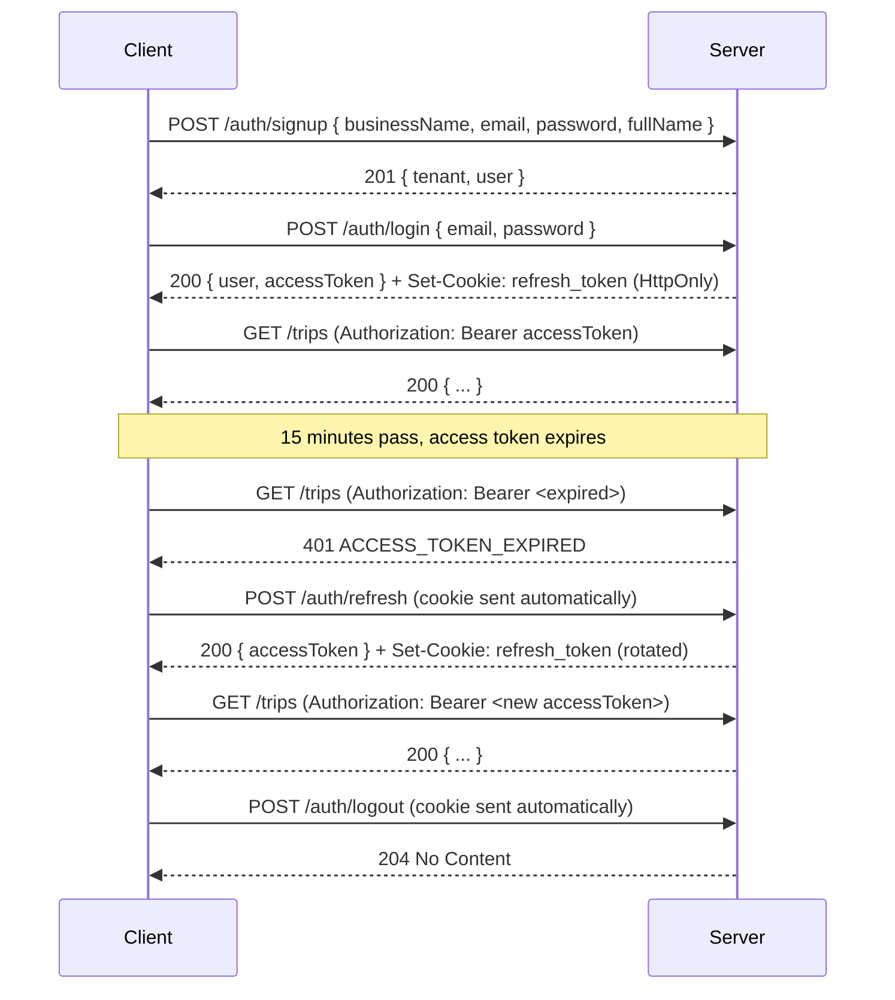

# Frontend readiness inventory

_Last updated: 2026-07-19. Reviewers: TBD._

A single-file reference for a frontend developer starting work against Modules 1-3 of this API. Assumes zero backend context. Sourced entirely from the actual route files, validators, and services — every claim below is checkable against `src/` if it looks wrong.

## 1. Base URL and auth

- Base URL (dev): `http://localhost:8000/api/v1`.
- Auth: JWT bearer tokens. Send `Authorization: Bearer <accessToken>` on every request to a protected endpoint.
- Access token expiry: 15 minutes (`JWT_ACCESS_TTL`, default `"15m"` — `src/config/env.js`).
- Refresh token: an HttpOnly cookie (`refresh_token`), scoped to path `/api/v1/auth` so the browser only sends it back on auth endpoints, not on every request. It is never present in any JSON response body. Default expiry 30 days (`JWT_REFRESH_TTL`).
- Refresh rotation: every successful `POST /auth/refresh` issues a brand-new access token *and* a brand-new refresh token, replacing the cookie. The old refresh token is immediately revoked. If a client ever presents a refresh token that was already rotated away from, the server treats that as a signal of token theft: it revokes every refresh token for that user (forcing every session to re-login) and returns `401 REFRESH_TOKEN_REUSED`.
- CORS: currently permissive in this dev environment. Production origin allowlisting is not yet configured — treat this as an infrastructure task for whenever this ships beyond local dev, not something to build UI logic around today.

## 2. Auth flow



`GET /auth/me` (requires `Authorization`) returns `{ "user": { ... } }` for the currently authenticated user — useful for a page-load "who am I" check without a full login round trip.

## 3. Response envelopes

There is **no uniform success envelope** — each endpoint documents its own shape, and they genuinely differ:

```json
{ "trip": { "...": "..." } }
{ "trips": [ "..." ], "pagination": { "...": "..." }, "aggregates": { "...": "..." } }
{ "vehicles": [ "..." ], "pagination": { "...": "..." } }
{ "groups": [ "..." ], "grand_total": { "...": "..." }, "filters_applied": { "...": "..." } }
```

Error responses **are** uniform:

```json
{
  "error": {
    "code": "MACHINE_READABLE_CODE",
    "message": "Human-readable text, safe to show as-is for 4xx.",
    "details": { "...": "optional, code-specific" }
  }
}
```

Always branch on `error.code`. `error.message` can change wording without notice; `error.code` is the stable contract. Every 4xx `message` is written to be shown directly to a user. 5xx messages are selectively masked (`500`/`502`/`503`/`504` become a generic `"Internal server error"`; other 5xx codes, notably `501`, pass their real message through — see ADR-007) — in practice, no endpoint in Modules 1-3 currently returns a 501, so this mostly matters for future-proofing.

## 4. Permission model

Reproduced from `src/config/accessMatrix.js` (the authoritative source — cross-check there if this table and the code ever disagree):

| Permission key | Roles allowed |
| --- | --- |
| `settings:read` | owner, admin, accountant, staff, viewer |
| `settings:update` | owner, admin |
| `users:list` | owner, admin, accountant, viewer |
| `users:create` | owner, admin |
| `users:update_role` | owner, admin |
| `users:deactivate` | owner, admin |
| `customers:read` | owner, admin, accountant, staff, viewer |
| `customers:write` | owner, admin, accountant, staff |
| `vehicles:read` | owner, admin, accountant, staff, viewer |
| `vehicles:write` | owner, admin, accountant, staff |
| `drivers:read` | owner, admin, accountant, staff, viewer |
| `drivers:write` | owner, admin, accountant, staff |
| `pricing:read` | owner, admin, accountant, staff, viewer |
| `pricing:write` | owner, admin |
| `trips:read` | owner, admin, accountant, staff, viewer |
| `trips:write` | owner, admin, accountant, staff |
| `trips:finalize` | owner, admin, accountant |
| `trips:cancel` | owner, admin, accountant |
| `invoices:*`, `payments:*`, `reports:read` | defined for Module 4+, not yet consumed by any route |

Rough role hierarchy for UI-gating purposes: `owner` and `admin` can do nearly everything; `accountant` handles financial/closing operations (finalize, cancel) plus read access everywhere; `staff` does day-to-day data entry (create/edit/finalize trips and masters, but cannot cancel a trip or write pricing rates); `viewer` is read-only everywhere. This is a paraphrase for UI-design purposes, not a substitute for checking the table above against a specific permission key.

**UX pattern for 403s:** the response includes `error.details.required` naming the permission key that was missing (e.g. `"trips:cancel"`). A reasonable default UI treatment is "You need the `<required>` permission to do this" or a role-aware friendlier string mapped from the same key client-side.

## 5. Endpoint inventory

Every endpoint across Modules 1-3, grouped by area. `(public)` means no `Authorization` header is required.

**Auth** — `src/api/v1/auth.routes.js`, mounted at `/api/v1/auth`

```
POST   /auth/signup   — public          — Create a new tenant + its owner user
POST   /auth/login    — public          — Log in, returns accessToken + sets refresh cookie
POST   /auth/refresh  — public (cookie) — Rotate refresh token, returns a new accessToken
POST   /auth/logout   — public (cookie) — Revoke the current refresh token
GET    /auth/me       — authenticated   — Return the current user
```

**Settings** — `src/api/v1/settings.routes.js`, mounted at `/api/v1/settings`

```
GET    /settings/business  — settings:read   — Read the tenant's business profile
PATCH  /settings/business  — settings:update — Update it (includes state_code, trip_sheet_prefix)
```

**Users** — `src/api/v1/users.routes.js`, mounted at `/api/v1/users`

```
GET    /users              — users:list        — List users in the current tenant
POST   /users              — users:create       — Create a user
PATCH  /users/:userId/role   — users:update_role  — Change a user's role
PATCH  /users/:userId/status — users:deactivate   — Activate/deactivate a user
```

**Vehicles** — `src/api/v1/vehicles.routes.js`, mounted at `/api/v1/vehicles`

```
GET    /vehicles                    — vehicles:read  — List, with search/type/archived filters
POST   /vehicles                    — vehicles:write — Create
GET    /vehicles/:vehicleId          — vehicles:read  — Get one
PATCH  /vehicles/:vehicleId          — vehicles:write — Update (vehicle_number immutable)
POST   /vehicles/:vehicleId/archive   — vehicles:write — Soft-delete (idempotent)
POST   /vehicles/:vehicleId/unarchive — vehicles:write — Reverse archive (idempotent)
```

**Drivers** — `src/api/v1/drivers.routes.js`, mounted at `/api/v1/drivers`

```
GET    /drivers                   — drivers:read  — List
POST   /drivers                   — drivers:write — Create (only full_name required)
GET    /drivers/:driverId          — drivers:read  — Get one
PATCH  /drivers/:driverId          — drivers:write — Update (every field editable)
POST   /drivers/:driverId/archive   — drivers:write — Soft-delete (idempotent)
POST   /drivers/:driverId/unarchive — drivers:write — Reverse archive (idempotent)
```

**Customers** — `src/api/v1/customers.routes.js`, mounted at `/api/v1/customers`

```
GET    /customers                              — customers:read  — List (search/type/archived)
POST   /customers                              — customers:write — Create (B2C or B2B)
GET    /customers/:customerId                   — customers:read  — Get one (optional ?withContacts=true)
PATCH  /customers/:customerId                   — customers:write — Update (customer_type immutable)
POST   /customers/:customerId/archive            — customers:write — Soft-delete (idempotent)
POST   /customers/:customerId/unarchive          — customers:write — Reverse archive (idempotent)
GET    /customers/:customerId/contacts           — customers:read  — List B2B contacts
POST   /customers/:customerId/contacts           — customers:write — Add a contact (B2B only)
DELETE /customers/:customerId/contacts/:contactId — customers:write — Remove a contact (hard delete)
```

**Pricing rules** — `src/api/v1/pricing.routes.js`, mounted at `/api/v1/pricing`

```
GET    /pricing/rules              — pricing:read  — List, with rule_type/vehicle_type/date filters
POST   /pricing/rules              — pricing:write — Create (owner/admin only)
GET    /pricing/rules/applicable   — pricing:read  — Look up the rule in effect for a date
GET    /pricing/rules/:ruleId       — pricing:read  — Get one
PATCH  /pricing/rules/:ruleId       — pricing:write — Update (only label/notes/effective_to)
POST   /pricing/rules/:ruleId/supersede — pricing:write — The only way to change a rate
POST   /pricing/preview            — pricing:read  — Run usage through the pricing calculator, no DB write
```

**Trips** — `src/api/v1/trips.routes.js`, mounted at `/api/v1/trips`

```
GET    /trips/performance-sheet            — trips:read     — Blue UI cost-sheet projection, JSON
GET    /trips/performance-sheet/export.csv — trips:read     — Same, as a CSV download
POST   /trips                              — trips:write    — Create a trip sheet (DRAFT)
GET    /trips                              — trips:read     — List, with filters/sort/pagination/aggregates
GET    /trips/:tripId                       — trips:read     — Get one, full detail
PATCH  /trips/:tripId                       — trips:write    — Edit a DRAFT trip
POST   /trips/:tripId/finalize              — trips:finalize — DRAFT → FINALIZED
POST   /trips/:tripId/cancel                — trips:cancel   — DRAFT/FINALIZED → CANCELLED
```

Not for frontend use: `src/api/v1/pings.routes.js` (`/pings`, `/pings/leak-test`) is a throwaway internal demo used to prove tenant isolation during Module 1's development. It's still mounted, but nothing in a real UI should call it.

## 6. Response shapes for TypeScript

Paste-ready types, sourced from the actual DB columns and response envelopes documented in each module's `03-database-schema.md`/`04-api-reference.md`. Money fields that appear as both `*_paise` and `*_rupees` are typed accordingly; fields shown as possibly `null` reflect an actual nullable column, not a guess.

```typescript
type Role = "owner" | "admin" | "accountant" | "staff" | "viewer";

type Tenant = {
  id: string;
  name: string;
  slug: string;
  state_code: string | null;
  trip_sheet_prefix: string; // default "TS"
  created_at: string;
  updated_at: string;
};

type User = {
  id: string;
  tenant_id: string;
  email: string;
  full_name: string;
  role: Role;
  is_active: boolean;
  last_login_at: string | null;
  created_at: string;
  updated_at: string;
  // password_hash is NEVER present in any API response
};

type VehicleType =
  | "SEDAN" | "SUV" | "HATCHBACK" | "INNOVA" | "KIA_CARNIVAL"
  | "TEMPO_TRAVELLER" | "MINI_BUS" | "BUS_50_SEATER" | "OTHER";

type Vehicle = {
  id: string;
  tenant_id: string;
  vehicle_number: string;         // canonical, e.g. "KA51AK1031"
  vehicle_number_display: string | null; // as typed, e.g. "KA 51 AK 1031"
  vehicle_type: VehicleType;
  make_model: string | null;
  registration_state: string | null; // 2-letter
  seating_capacity: number | null;
  fuel_type: string | null;       // free text at the DB layer
  year_of_manufacture: number | null;
  notes: string | null;
  is_active: boolean;
  created_by: string | null;
  created_at: string;
  updated_at: string;
};

type Driver = {
  id: string;
  tenant_id: string;
  full_name: string; // the only required field
  phone: string | null;           // canonical, 91-prefixed
  phone_display: string | null;
  license_number: string | null;  // uppercased
  license_expiry_date: string | null; // YYYY-MM-DD
  address_line: string | null;
  emergency_contact: string | null; // canonical only, no display twin
  notes: string | null;
  is_active: boolean;
  created_by: string | null;
  created_at: string;
  updated_at: string;
};

type CustomerType = "B2C" | "B2B";

type Address = {
  line1?: string; line2?: string; city?: string;
  district?: string; state?: string; pincode?: string;
  country?: string; // defaults to "India"
};

type Customer = {
  id: string;
  tenant_id: string;
  customer_type: CustomerType; // immutable after create
  name: string | null;            // required for B2C, optional billing-contact name for B2B
  company_name: string | null;    // required for B2B, forbidden for B2C
  gstin: string | null;           // required for B2B, rare for B2C
  pan: string | null;
  state_code: string | null;      // required for B2B; drives IGST vs CGST+SGST later
  phone: string | null;
  phone_display: string | null;
  email: string | null;           // NOT unique — shared emails are expected
  address: Address;
  credit_days: number;            // 0-365, default 0
  notes: string | null;
  is_active: boolean;
  created_by: string | null;
  created_at: string;
  updated_at: string;
  contacts?: CustomerContact[];    // present only when ?withContacts=true
};

type CustomerContact = {
  id: string;
  customer_id: string;
  name: string;
  role: string | null;
  phone: string | null;
  phone_display: string | null;
  email: string | null;
  is_primary: boolean; // at most one true per customer
  created_at: string;
  updated_at: string;
};

type PricingRuleType = "LOCAL_PACKAGE" | "OUTSTATION_SLAB" | "PERFORMANCE";

type PricingRule = {
  id: string;
  tenant_id: string;
  rule_type: PricingRuleType;
  vehicle_type: VehicleType;
  label: string; // display only, never used in calculation
  // LOCAL_PACKAGE only:
  base_hours: number | null;
  base_km: number | null;
  base_price_paise: number | null;
  extra_km_rate_paise: number | null;
  extra_hr_rate_paise: number | null;
  // OUTSTATION_SLAB only:
  slab_rate_paise: number | null;
  min_km_per_day: number | null;
  driver_batta_per_day_paise: number | null;
  // PERFORMANCE only:
  per_km_rate_paise: number | null;
  performance_batta_paise: number | null;
  effective_from: string; // YYYY-MM-DD
  effective_to: string | null; // null = still active
  notes: string | null;
  created_by: string | null;
  created_at: string;
  updated_at: string;
};

type TripServiceType = "LOCAL" | "OUTSTATION";
type TripBillingMode = "GST" | "PERFORMANCE";
type TripStatus = "DRAFT" | "FINALIZED" | "INVOICED" | "CANCELLED";

// The lean shape returned by GET /trips (list). Omits breakdown,
// every snap_* field, and tolls — see TripSheetDetail for those.
type TripSheetListItem = {
  id: string;
  tenant_id: string;
  trip_sheet_number: string; // "{prefix}-{seq}/{FY}", e.g. "TS-1586/26-27"
  service_type: TripServiceType;
  billing_mode: TripBillingMode;
  status: TripStatus;
  customer_id: string;
  vehicle_id: string;
  driver_id: string | null;
  snapshot_vehicle_number: string;
  snapshot_vehicle_type: VehicleType;
  snapshot_customer_name: string;
  snapshot_customer_gstin: string | null;
  trip_date: string; // YYYY-MM-DD
  total_km: number;
  total_hours: number;
  total_days: number;
  subtotal_paise: number;
  gross_paise: number;
  net_payable_paise: number;
  advance_paise: number;
  finalized_at: string | null;
  cancelled_at: string | null;
  invoice_id: string | null;
  created_at: string;
  updated_at: string;
};

// GET /trips/:id, and the response of POST/PATCH/finalize/cancel.
type TripSheetDetail = TripSheetListItem & {
  pricing_rule_id: string | null;
  start_datetime: string | null;
  end_datetime: string | null;
  opening_km: number | null;
  closing_km: number | null;
  toll_paise: number;
  parking_paise: number;
  permit_paise: number;
  fasttag_paise: number;
  base_amount_paise: number;
  extras_amount_paise: number;
  driver_batta_paise: number;
  breakdown: Array<{ label: string; value_paise: number; detail?: string }>;
  // Rule snapshot — nullable per rule_type (see 03-database-schema.md)
  snap_base_hours: number | null;
  snap_base_km: number | null;
  snap_base_price_paise: number | null;
  snap_extra_km_rate_paise: number | null;
  snap_extra_hr_rate_paise: number | null;
  snap_slab_rate_paise: number | null;
  snap_min_km_per_day: number | null;
  snap_driver_batta_per_day_paise: number | null;
  snap_per_km_rate_paise: number | null;
  snap_performance_batta_paise: number | null;
  booked_by: string | null;
  pax_note: string | null;
  remarks: string | null;
  created_by: string | null;
  finalized_by: string | null;
  invoiced_at: string | null;
  cancelled_by: string | null;
  cancellation_reason: string | null;
  tolls: TripToll[];
};

type TripToll = {
  id: string;
  trip_sheet_id: string;
  plaza_name: string;
  toll_id: string | null;
  amount_paise: number;
  crossed_at: string | null;
  vehicle_number: string | null;
  closing_balance_paise: number | null;
  notes: string | null;
  line_number: number;
  created_at: string;
};

// One row of GET /trips/performance-sheet's Blue UI projection.
type PerformanceSheetRow = {
  SL: number;
  DATE: string; // YYYY-MM-DD
  VEHICLE_TYPE: VehicleType;
  VEHICLE_NUMBER: string;
  TOTAL_RUNNING_KM: number;
  PER_KM_COST_RUPEES: number;
  PER_KM_COST_PAISE: number;
  TOTAL_COST_RUPEES: number;   // base running cost (per_km * km)
  TOTAL_COST_PAISE: number;
  BATA_RUPEES: number;
  BATA_PAISE: number;
  TOLL_CHARGES_RUPEES: number;
  TOLL_CHARGES_PAISE: number;
  GRAND_TOTAL_RUPEES: number;  // final total, including batta + tolls
  GRAND_TOTAL_PAISE: number;
  TRIP_ID: string;
  STATUS: TripStatus;
};

type PerformanceSheetGroup = {
  customer_id: string;
  customer_name: string;
  customer_type: CustomerType | null; // null if the customer record no longer resolves
  rows: PerformanceSheetRow[];
  subtotal: {
    total_running_km: number;
    running_cost_paise: number;
    batta_paise: number;
    toll_paise: number;
    total_paise: number;
  };
};

type PerformanceSheet = {
  groups: PerformanceSheetGroup[];
  grand_total: {
    total_running_km: number;
    running_cost_paise: number;
    batta_paise: number;
    toll_paise: number;
    total_paise: number;
    row_count: number;
    group_count: number;
  };
  filters_applied: Record<string, unknown>;
};

type Invoice = never; // Module 4 — not built yet, do not model this
```

## 7. Money handling

Every monetary field on the wire is one of two conventions: `*_paise` (integer, exact, the value to do arithmetic on) or `*_rupees` (number, formatted for display). Many responses carry both for the same figure — `PER_KM_COST_PAISE`/`PER_KM_COST_RUPEES` on a performance-sheet row, for instance. Always compute with the `_paise` value; treat `_rupees` as display-only, already-converted output, not something to re-derive math from (floating-point rupee arithmetic is exactly the failure mode the backend avoids internally by never doing it — see ADR-002). For display formatting, `Intl.NumberFormat('en-IN', { style: 'currency', currency: 'INR' }).format(paise / 100)` matches the backend's own `formatINR` convention (`₹` symbol, Indian digit grouping, two decimal places).

## 8. Pagination

Every list endpoint (`GET /vehicles`, `/drivers`, `/customers`, `/pricing/rules`, `/trips`, `/users`) uses offset/limit:

```
GET /trips?limit=25&offset=50
```

Response includes:

```json
{ "pagination": { "total": 143, "limit": 25, "offset": 50, "has_more": true } }
```

Note: Module 2's list endpoints (`vehicles`, `drivers`, `customers`, `pricing/rules`, `users`) return `pagination: { total, limit, offset }` **without** `has_more` — computing it client-side is `offset + <items returned> < total`. `GET /trips` is the one endpoint that includes `has_more` directly in the response. The performance-sheet endpoints have no pagination at all — they return the full filtered/grouped set, capped at 10,000 rows (`EXPORT_TOO_LARGE` beyond that).

## 9. Filter conventions

- IDs: a single UUID v4 per filter (e.g. `customer_id=<uuid>`), never a comma-separated list of IDs anywhere in Modules 1-3.
- Dates: `YYYY-MM-DD` for date-only filters (`from_date`, `to_date`, `trip_date`, `on_date`); full ISO 8601 datetime strings for timestamp fields (`start_datetime`, `crossed_at`).
- Multi-value enums: a single comma-separated string, e.g. `status=DRAFT,FINALIZED` on `GET /trips` and the performance-sheet endpoints. Not repeated query params (`status=DRAFT&status=FINALIZED` does not work).
- Substring search: a `search` query param, present on every Module 2 list endpoint and on `GET /trips`; which columns it matches varies per endpoint (see each module's `04-api-reference.md`).
- Booleans: the literal strings `"true"`/`"false"` in the query string (`includeArchived=true`, `includeCancelled=true`) — Joi coerces them, but send them as strings, not JSON booleans, since they travel in a URL.

## 10. Error codes to handle specially

| Code | UX action |
| --- | --- |
| `AUTH_REQUIRED` | Redirect to login |
| `ACCESS_TOKEN_EXPIRED` | Attempt `POST /auth/refresh` silently, then retry the original request once with the new token |
| `AUTH_INVALID` | Redirect to login (token is malformed, or the account behind it no longer exists) |
| `INVALID_CREDENTIALS` | Show a generic "email or password incorrect" — the backend deliberately doesn't distinguish which one was wrong |
| `REFRESH_TOKEN_REUSED` | Force logout, clear all local auth state — this is a possible-theft signal, not a routine expiry |
| `REFRESH_TOKEN_MISSING` / `REFRESH_TOKEN_INVALID` | Redirect to login |
| `FORBIDDEN` | Show role-restricted UI / a "you need the `<details.required>` permission" message |
| `VALIDATION_ERROR` | Highlight the specific fields named in `details.fields` (an array of `{ field, message }`) |
| `TRIP_NOT_EDITABLE` | Disable the edit form, show the trip read-only, surface `details.current_status` |
| `INVALID_STATE_TRANSITION` | Reload the trip's current state; `details.allowed_transitions` lists what's actually available from here |
| `TRIP_STATUS_CHANGED` / `TRIP_STATUS_CHANGED_DURING_UPDATE` | Reload and let the user retry — a concurrent transition won the race |
| `EXPORT_TOO_LARGE` | Suggest narrowing with a date range or customer filter; `details.max_rows` names the cap |
| `NO_APPLICABLE_PRICING_RULE` | Point the user at the pricing rules screen for the named `details.vehicle_type`/`details.rule_type` |
| `TOLL_INPUT_CONFLICT` | Clear whichever of the lump-sum/itemized toll inputs the user isn't actively using |
| `GSTIN_STATE_MISMATCH` | Highlight both the GSTIN and state fields; `details.gstin_state` names what the GSTIN actually encodes |
| `*_ALREADY_EXISTS` (vehicle/driver/customer number/phone/gstin) | Offer to navigate to the existing record instead of retrying the create |
| `*_ARCHIVED_EXISTS` | Offer an "unarchive instead" action, pointing at the id in `details` |

## 11. Gotchas that will save days

- Trip sheet numbers are per-tenant, per-fiscal-year (`{prefix}-{seq}/{FY}`, Indian FY = April-March). Don't cache or predict the next number client-side; always use what the create response returns.
- Snapshot fields on a trip (`snapshot_*`, every `snap_*`) are immutable by design (ADR-005). Do not build a "resync from current rule/vehicle/customer" action — there is no such endpoint, and it would defeat the entire point of the snapshot.
- Every `PATCH /trips/:id` recomputes all derived totals from scratch via the pricing engine, using the trip's *original* rule. There's no partial-recompute mode. For a pre-submit cost estimate before creating or editing a trip, use `POST /pricing/preview` instead of guessing client-side.
- Trip cancellation requires a reason, minimum 3 characters — there is no cancel-without-reason path; don't build a one-click cancel button without a text input.
- The performance-sheet endpoints filter to `billing_mode = 'PERFORMANCE'` and cannot be pointed at GST trips — an "internal cost sheet" screen should call these, not `GET /trips` with a client-side filter.
- CSV downloads (`GET /trips/performance-sheet/export.csv`) carry `X-Row-Count` and `X-Group-Count` response headers — read them for a "showing N rows across M customers" message instead of parsing the CSV body client-side to count.
- GSTIN's state cross-check happens server-side (`GSTIN_STATE_MISMATCH`); the UI should still validate the format (`^[0-9A-Z]{15}$`) locally to fail fast before a round trip.
- `includeArchived`/`includeCancelled` default to `false` everywhere they exist; an explicit `status` filter on `GET /trips` (or the performance sheet) always overrides `includeCancelled`, in both directions.

## 12. Local development

- Server: `npm run dev`, port `8000` by default (`PORT` env var).
- Database: a host-installed Postgres instance, connection string in `.env`'s `DATABASE_URL`. No Docker is required or used anywhere in this codebase's current setup.
- CORS is currently open in this dev environment; a frontend on a different port needs no extra configuration to reach the API locally.

## 13. Testing against a fresh tenant

```bash
curl -X POST http://localhost:8000/api/v1/auth/signup \
  -H "Content-Type: application/json" \
  -d '{"businessName":"My Test Co","email":"me@example.com","password":"Passw0rd123","fullName":"Test Owner"}'

curl -X POST http://localhost:8000/api/v1/auth/login \
  -H "Content-Type: application/json" \
  -d '{"email":"me@example.com","password":"Passw0rd123"}'
# -> use the returned accessToken as the Bearer token for everything else
```

The `scripts/verify-*.sh` files in this repo build much larger fixture sets (vehicles, drivers, customers, pricing rules, trips) the same way, with real request bodies — they're a good source of realistic example payloads for every endpoint if a specific request shape is unclear.

## 14. Modules 1-3 are stable; Module 4 is not built yet

Modules 1-3's API surface is considered stable — any breaking change to an existing endpoint's shape would go through a new `/v2` path rather than changing what's documented here in place. Module 4 (invoicing, GST computation, payments) has not been built: the trip lifecycle already has an `INVOICED` status and a service-only `markTripInvoiced` function reserved for it, but no route exposes it, and nothing about invoices, payment recording, or GST line-item computation exists yet. Do not build invoice or payment UI against this API today — those endpoints don't exist, and their eventual shape isn't committed to anything documented here.
