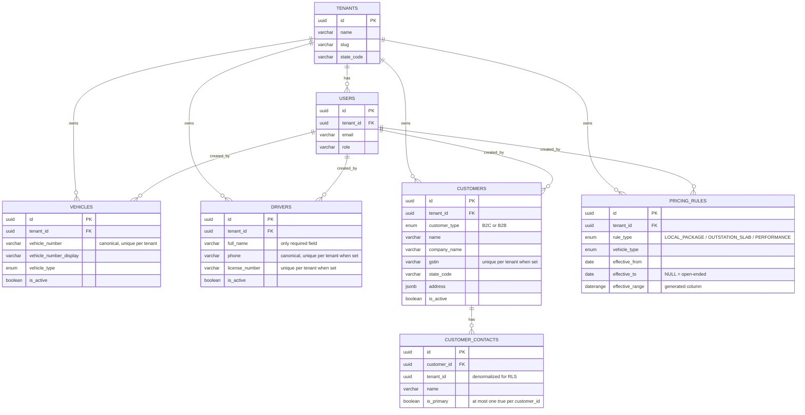

# Entity relationship diagram

_Last updated: 2026-07-18. Reviewers: TBD._

Covers `tenants` and `users` (Module 1, shown for context) plus every table Module 2 adds. Foreign keys, cardinality, and key fields only — see `03-database-schema.md` for full column lists.

Notes that don't fit cleanly into the diagram itself: `PRICING_RULES.vehicle_type` shares the same `vehicle_type_enum` as `VEHICLES.vehicle_type` but is **not** a foreign key to a specific vehicle — a pricing rule applies to an entire vehicle *category* (e.g. every `SEDAN`), not to one physical vehicle. `CUSTOMER_CONTACTS.tenant_id` is denormalized (duplicated from the parent `CUSTOMERS` row) purely so its row-level security policy can filter without a join. Every `created_by` edge shown above is nullable (`ON DELETE` behavior: the FK has no `ON DELETE` action specified, so it defaults to `NO ACTION` — a user cannot be hard-deleted while still referenced as a creator; this repo has no user hard-delete endpoint regardless, see Module 1).
