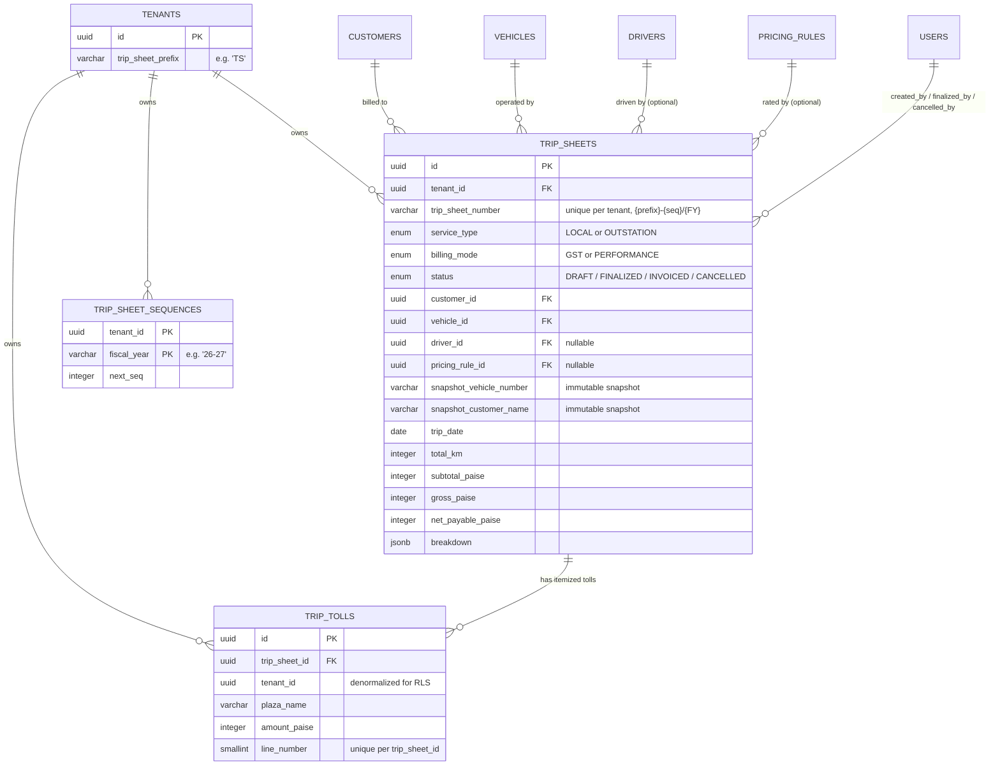

# Entity relationship diagram

_Last updated: 2026-07-19. Reviewers: TBD._

Scoped to Module 3's own tables (`trip_sheets`, `trip_sheet_sequences`, `trip_tolls`) plus their foreign keys into Module 1/2 tables, shown for context. For the full Module 1/2 ER diagram, see `docs/modules/module-2-master-data/diagrams/er-diagram.md`.

Notes that don't fit cleanly into the diagram itself: `TRIP_SHEETS.pricing_rule_id` is nullable and `ON DELETE SET NULL` — the row's own `snap_*` columns (not shown individually above; see `03-database-schema.md` for the full list) are the fallback source of truth if the referenced rule ever goes away, which is the entire point of the snapshot pattern (ADR-005). `TRIP_TOLLS.tenant_id` is denormalized from the parent `TRIP_SHEETS` row, the same pattern `CUSTOMER_CONTACTS.tenant_id` uses in Module 2, purely so its row-level security policy can filter without a join. `TRIP_SHEET_SEQUENCES` has no foreign key to any individual trip — it's a pure counter, keyed on `(tenant_id, fiscal_year)`, that trip-number allocation draws from atomically.
