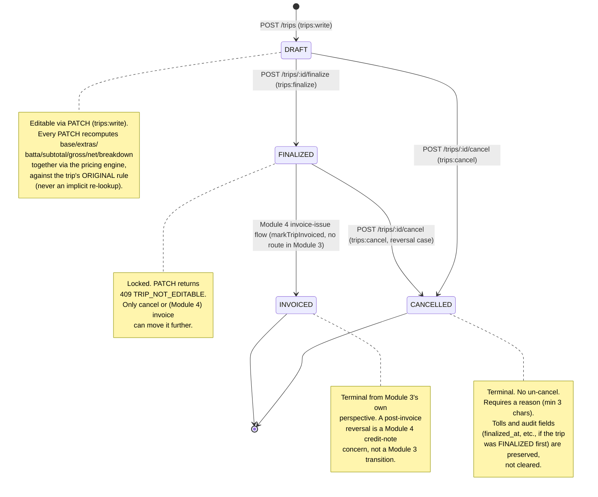

# Lifecycle state machine

_Last updated: 2026-07-19. Reviewers: TBD._

The full legal-transition table lives in `src/domain/tripLifecycle/index.js` as a `TRANSITIONS` map of `Set`s — the diagram below is a direct rendering of that map, not a separate model that could drift from the code.

Every transition — including the DRAFT-only PATCH, which isn't a status change itself but is guarded by the same status check — is safe under concurrency through two independent mechanisms working together, not one: `tripRepo.findByIdForUpdate` issues `SELECT ... FOR UPDATE` inside the request's own transaction, so a second concurrent request against the same trip blocks on that read until the first transaction commits or rolls back; and every write that follows is additionally guarded by its own `WHERE status = $fromStatus` clause (`transitionStatus`, `updateDraft`), so even in a scenario where the lock's protection were somehow bypassed, a stale-status `UPDATE` matches zero rows and the service reports `409` rather than silently applying. `scripts/verify-trip-sheet-lifecycle.sh` proves this isn't just a claim: 5 parallel `finalize` requests against one trip produce exactly one `200` and four `409 INVALID_STATE_TRANSITION`.

See ADR-005 for why the snapshot fields that make a trip's recorded cost meaningful stay immutable through every transition shown above (including DRAFT PATCH — a recompute uses the same rule, never a newer one), and ADR-006 for the pure-domain-module pattern `src/domain/tripLifecycle/` follows, which is what makes this diagram a faithful rendering of actual code rather than a separately-maintained description of intended behavior.
