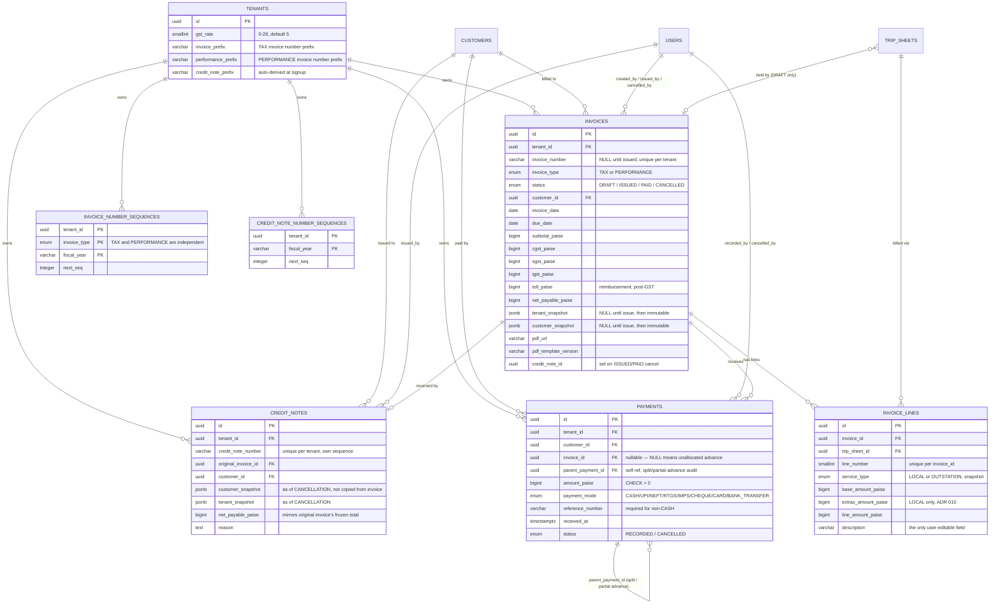

# Entity relationship diagram

_Last updated: 2026-07-23. Reviewers: TBD._

Scoped to Module 4's own tables (`invoices`, `invoice_lines`, `invoice_number_sequences`, `credit_notes`, `credit_note_number_sequences`, `payments`) plus their foreign keys into Modules 1-3, shown for context. For the full Module 1/2 and Module 3 ER diagrams, see `docs/modules/module-2-master-data/diagrams/er-diagram.md` and `docs/modules/module-3-trip-sheets/diagrams/er-diagram.md`.

Notes that don't fit cleanly into the diagram itself: `INVOICES.credit_note_id` has no declared FK `ON DELETE` action — it's populated only after the credit note already exists, inside the same transaction as the invoice's own `CANCELLED` transition, so the two rows are always created/committed together. `PAYMENTS.parent_payment_id` is self-referential and used for two distinct audit relationships that share the same column: an over-payment's spillover advance points at the applied portion that triggered the split, and a partial advance application's new applied-portion row points at the advance it was carved out of — `payments_parent_self_ref` (`CHECK (parent_payment_id IS NULL OR parent_payment_id <> id)`) is the only constraint distinguishing "this is a derived row" from "this is a standalone payment," the actual relationship type is inferred from context (whether `invoice_id` is set on the row versus its parent), not a separate discriminator column. `TRIP_SHEETS.held_by_invoice_id` (Module 3's own column, extended by Task 4.1) is only ever non-null while a trip sits on a DRAFT invoice — an `ISSUED` invoice's trips move to `trip_sheets.status = 'INVOICED'` instead, which is the actual, permanent record of "this trip belongs to this invoice" (via `trip_sheets.invoice_id`, also Module 3's own column), not the hold.
