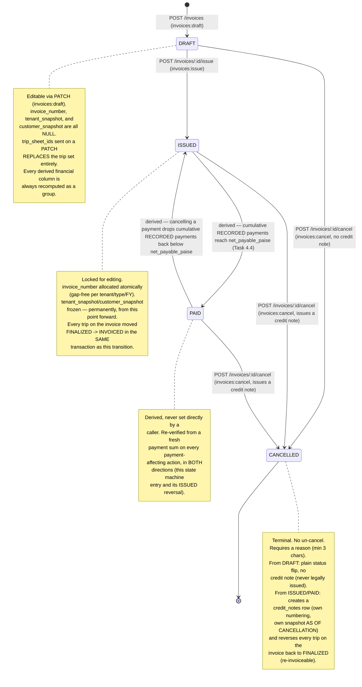

# Invoice lifecycle state machine

_Last updated: 2026-07-23. Reviewers: TBD._

The full legal-transition table lives in `src/domain/invoiceLifecycle/index.js` as a `TRANSITIONS` map of `Set`s — the diagram below is a direct rendering of that map, not a separate model that could drift from the code.

Every transition that changes status opens with `invoiceRepo.findByIdForUpdate`, which issues `SELECT ... FOR UPDATE` inside the request's own transaction — a concurrent request against the same invoice blocks on that read until the first transaction commits or rolls back. Every write that follows is additionally guarded by its own `WHERE status = $fromStatus` clause (`transitionStatus`), so even in a scenario where the lock's protection were somehow bypassed, a stale-status `UPDATE` matches zero rows and the service reports `409 INVOICE_STATUS_CHANGED` rather than silently applying. `scripts/verify-invoice-lifecycle.sh` proves this under real concurrency (parallel `issue` requests against distinct DRAFTs, asserting gap-free sequential numbering across all of them) rather than by inspection alone.

See ADR-012 for why the `INVOICED → FINALIZED` reversal (triggered by cancelling an ISSUED/PAID invoice, shown on the trip side, not this diagram) needed a dedicated repository function (`tripSheet.repository.js#reverseInvoiced`) rather than reusing `transitionStatus`'s own `COALESCE`-based column update — that pattern can only ADD a value, never clear one back to `NULL`, and this specific reversal needs to clear `invoiced_at`/`invoice_id`. See `docs/modules/module-3-trip-sheets/diagrams/lifecycle-state-machine.md` for the trip's own state machine, which this invoice state machine drives at exactly two moments (issue and cancel-of-an-issued-invoice).
